# Architecture Système - API Gestion de Stock

## 🏗️ Diagramme d'Architecture

```mermaid
graph TB
    %% Couche Présentation
    subgraph "🎨 Couche Présentation"
        SWAGGER[Swagger UI<br/>Documentation API]
        POSTMAN[Postman<br/>Tests API]
        CLIENT[Client HTTP<br/>Applications]
    end

    %% Couche Contrôleur
    subgraph "🎮 Couche Contrôleur"
        AC[ArticleController]
        CC[CategoryController]
        CLC[CommandeClientController]
        CFC[CommandeFournisseurController]
        MSC[MouvementStockController]
        AUTH[AuthenticationController]
    end

    %% Couche Service
    subgraph "⚙️ Couche Service"
        AS[ArticleService]
        CS[CategoryService]
        CLS[CommandeClientService]
        CFS[CommandeFournisseurService]
        MSS[MouvementStockService]
        AUS[AuthenticationService]
    end

    %% Couche Repository
    subgraph "🗄️ Couche Repository"
        AR[ArticleRepository]
        CR[CategoryRepository]
        CLR[CommandeClientRepository]
        CFR[CommandeFournisseurRepository]
        MSR[MouvementStockRepository]
        UR[UtilisateurRepository]
    end

    %% Couche Modèle
    subgraph "📊 Couche Modèle"
        AE[AbstractEntity]
        ART[Article]
        CAT[Category]
        CLI[Client]
        FOU[Fournisseur]
        COM[CommandeClient]
        COF[CommandeFournisseur]
        MS[MouvementStock]
        USR[Utilisateur]
    end

    %% Couche Configuration
    subgraph "⚙️ Couche Configuration"
        SC[SecurityConfig]
        JC[JpaConfig]
        WC[WebConfig]
        SWC[SwaggerConfig]
        ACONF[ApplicationConfig]
    end

    %% Base de Données
    subgraph "💾 Base de Données"
        MYSQL[(MySQL<br/>gestiondestock_db)]
    end

    %% Relations
    SWAGGER --> AC
    SWAGGER --> CC
    SWAGGER --> CLC
    SWAGGER --> CFC
    SWAGGER --> MSC
    SWAGGER --> AUTH
    
    POSTMAN --> AC
    POSTMAN --> CC
    POSTMAN --> CLC
    POSTMAN --> CFC
    POSTMAN --> MSC
    POSTMAN --> AUTH
    
    CLIENT --> AC
    CLIENT --> CC
    CLIENT --> CLC
    CLIENT --> CFC
    CLIENT --> MSC
    CLIENT --> AUTH

    AC --> AS
    CC --> CS
    CLC --> CLS
    CFC --> CFS
    MSC --> MSS
    AUTH --> AUS

    AS --> AR
    CS --> CR
    CLS --> CLR
    CFS --> CFR
    MSS --> MSR
    AUS --> UR

    AR --> ART
    CR --> CAT
    CLR --> COM
    CFR --> COF
    MSR --> MS
    UR --> USR

    ART --> AE
    CAT --> AE
    CLI --> AE
    FOU --> AE
    COM --> AE
    COF --> AE
    MS --> AE
    USR --> AE

    SC --> AC
    SC --> CC
    SC --> CLC
    SC --> CFC
    SC --> MSC
    SC --> AUTH

    JC --> AR
    JC --> CR
    JC --> CLR
    JC --> CFR
    JC --> MSR
    JC --> UR

    WC --> AC
    WC --> CC
    WC --> CLC
    WC --> CFC
    WC --> MSC
    WC --> AUTH

    SWC --> SWAGGER

    AR --> MYSQL
    CR --> MYSQL
    CLR --> MYSQL
    CFR --> MYSQL
    MSR --> MYSQL
    UR --> MYSQL

    %% Styles
    classDef controller fill:#e1f5fe
    classDef service fill:#f3e5f5
    classDef repository fill:#e8f5e8
    classDef model fill:#fff3e0
    classDef config fill:#fce4ec
    classDef database fill:#f1f8e9
    classDef presentation fill:#e0f2f1

    class AC,CC,CLC,CFC,MSC,AUTH controller
    class AS,CS,CLS,CFS,MSS,AUS service
    class AR,CR,CLR,CFR,MSR,UR repository
    class ART,CAT,CLI,FOU,COM,COF,MS,USR,AE model
    class SC,JC,WC,SWC,ACONF config
    class MYSQL database
    class SWAGGER,POSTMAN,CLIENT presentation
```

## 📋 Description des Couches

### 🎨 **Couche Présentation**
- **Swagger UI** : Interface de documentation interactive de l'API
- **Postman** : Outil de test des endpoints API
- **Client HTTP** : Applications tierces consommant l'API

### 🎮 **Couche Contrôleur (Controllers)**
- **ArticleController** : Gestion des articles (CRUD)
- **CategoryController** : Gestion des catégories
- **CommandeClientController** : Gestion des commandes clients
- **CommandeFournisseurController** : Gestion des commandes fournisseurs
- **MouvementStockController** : Gestion des mouvements de stock
- **AuthenticationController** : Authentification et autorisation

### ⚙️ **Couche Service**
- **ArticleService** : Logique métier des articles
- **CategoryService** : Logique métier des catégories
- **CommandeClientService** : Logique métier des commandes clients
- **CommandeFournisseurService** : Logique métier des commandes fournisseurs
- **MouvementStockService** : Logique métier des mouvements de stock
- **AuthenticationService** : Logique d'authentification

### 🗄️ **Couche Repository**
- **ArticleRepository** : Accès aux données des articles
- **CategoryRepository** : Accès aux données des catégories
- **CommandeClientRepository** : Accès aux données des commandes clients
- **CommandeFournisseurRepository** : Accès aux données des commandes fournisseurs
- **MouvementStockRepository** : Accès aux données des mouvements de stock
- **UtilisateurRepository** : Accès aux données des utilisateurs

### 📊 **Couche Modèle**
- **AbstractEntity** : Classe abstraite avec champs communs
- **Article** : Entité article
- **Category** : Entité catégorie
- **Client** : Entité client
- **Fournisseur** : Entité fournisseur
- **CommandeClient** : Entité commande client
- **CommandeFournisseur** : Entité commande fournisseur
- **MouvementStock** : Entité mouvement de stock
- **Utilisateur** : Entité utilisateur

### ⚙️ **Couche Configuration**
- **SecurityConfig** : Configuration de la sécurité
- **JpaConfig** : Configuration JPA/Hibernate
- **WebConfig** : Configuration web
- **SwaggerConfig** : Configuration Swagger
- **ApplicationConfig** : Configuration générale de l'application

### 💾 **Base de Données**
- **MySQL** : Base de données relationnelle

## 🔄 **Flux de Données**

### **Requête API**
1. **Client** → **Controller** : Requête HTTP
2. **Controller** → **Service** : Appel de la logique métier
3. **Service** → **Repository** : Accès aux données
4. **Repository** → **Base de Données** : Requête SQL
5. **Base de Données** → **Repository** : Résultat
6. **Repository** → **Service** : Données transformées
7. **Service** → **Controller** : Réponse métier
8. **Controller** → **Client** : Réponse HTTP

### **Sécurité**
- **SecurityConfig** intercepte toutes les requêtes
- **JwtAuthenticationFilter** valide les tokens JWT
- **AuthenticationService** gère l'authentification

## 🎯 **Avantages de cette Architecture**

### **Séparation des Responsabilités**
- Chaque couche a un rôle spécifique
- Facilite la maintenance et les tests
- Permet l'évolution indépendante des couches

### **Réutilisabilité**
- Services réutilisables par différents contrôleurs
- Repositories réutilisables par différents services
- Modèles réutilisables dans toute l'application

### **Testabilité**
- Tests unitaires par couche
- Mocks faciles à implémenter
- Tests d'intégration simplifiés

### **Évolutivité**
- Ajout facile de nouveaux endpoints
- Modification de la logique métier sans impact sur l'API
- Changement de base de données transparent

### **Sécurité**
- Centralisation de la sécurité
- Validation des données à chaque niveau
- Gestion des autorisations

## 🔧 **Technologies Utilisées**

### **Framework**
- **Spring Boot** : Framework principal
- **Spring MVC** : Couche web
- **Spring Data JPA** : Accès aux données
- **Spring Security** : Sécurité

### **Base de Données**
- **MySQL** : Base de données relationnelle
- **Hibernate** : ORM

### **Documentation**
- **Swagger/OpenAPI** : Documentation API
- **PlantUML** : Diagrammes UML

### **Sécurité**
- **JWT** : Tokens d'authentification
- **BCrypt** : Hashage des mots de passe

### **Outils**
- **Maven** : Gestion des dépendances
- **Postman** : Tests API
- **Git** : Versioning 